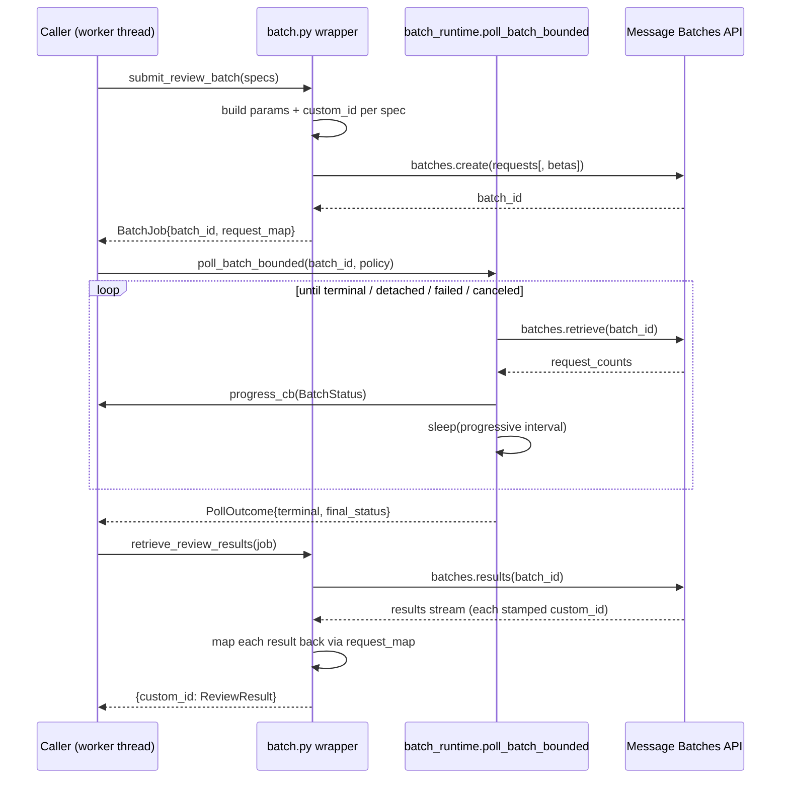

# Batch Processing: The Message Batches Backbone

A desktop application that makes you wait ninety minutes for an answer looks,
at first glance, like a usability mistake. Spec Critic embraces it on purpose.
Every per-spec review in this product — and every initial verification verdict
— leaves the user's machine, sits in Anthropic's batch queue alongside other
people's work, and comes back somewhere between forty-five minutes and two
hours later. There is no synchronous review path. **Ch 3 — A Run, End to End**
set that scene and called the run "asynchronous, batch-centric, walk-away."
This chapter is where that phrase earns its mechanics: the thin wrapper that
turns a list of specs into a batch, the bounded poller that watches it without
hammering the API or hanging the UI, the round-trip that reunites each result
with the spec it came from, and the one extended-output path that buys
headroom at the cost of a fragile, hardcoded beta header.

Two files carry the whole story. `src/batch/batch.py` is the wrapper: it builds
requests, submits them, and maps results back. `src/batch/batch_runtime.py` is
the runtime: a single bounded-polling loop, shared by every batch phase, that
knows how to wait. Together they are about four hundred lines, and almost every
line is in service of one decision and its consequences.

## The fundamental trade: throughput and cost over latency

The decision is this: **for the bulk model work, Spec Critic trades latency for
cost and output headroom.** Anthropic's Message Batches API processes requests
asynchronously, off the synchronous critical path, and in exchange charges
roughly half the per-token price of the same requests made in real time. It
also lifts the output ceiling in a way no synchronous call can reach (the 300k
path, below). The price is wall-clock time: a typical batch completes in
forty-five minutes to two hours, with a 24-hour ceiling the API almost never
approaches.

For an interactive chatbot that trade would be absurd. For Spec Critic it is
nearly free. A reviewer is not staring at the screen waiting for one answer;
they are handing over a folder of twenty CSI-format specification sections and
asking for a defensible, evidence-grounded compliance report. That is a
job-shaped task, not a conversation. The reviewer submits it and goes to lunch.
The 50% cost saving, multiplied across thousands of pages of dense mechanical
and plumbing specs, is the difference between a tool an office can afford to run
on every project and one it rations.

So the latency is not a flaw the architecture tolerates; it is the grain the
architecture is cut along. The entire control structure — short bursts of local
work separated by long waits, a worker thread that submits and then sleeps, a
GUI that shows a progress bar rather than a spinner — falls out of this single
choice. Get the choice, and the rest of the chapter is just careful engineering
around "submit, walk away, collect later."

Not everything rides the batch. Two phases stay synchronous because they are
small, interactive, or both, and the table below is the honest map of what runs
where:

| Phase | Uses batch? | Output cap | Extended 300k eligible? | `custom_id` / notes |
|---|---|---|---|---|
| **Review** (per-spec) | **Yes — the only path** | 128k baseline | **Yes**, when a spec's input ≥ 200k tokens | `review__{sanitized}__{idx}` |
| **Cross-spec coordination** | No — synchronous streaming | 96k | No | one streamed call; see **Ch 8 — Cross-Spec Coordination** |
| **Verification** (initial wave) | Yes — batch waves | 16k | No | `verify__{idx}`; small unresolved tails flip to real time |
| **Verification** (retry / continuation) | Yes — follow-up waves | 16k | No | see **Ch 10 — Verification II** |
| **Triage** (opt-in Haiku pre-pass) | No — synchronous call | 8k | No | one call over short inputs; see **Ch 9 — Verification I** |

The output caps are the centralized per-phase budgets from
`api_config._PHASE_OUTPUT_BUDGET` (full configuration story in **Ch 12 —
Configuration, Models & Token Economics**). What matters at this layer is the
last column: only review is ever big enough to need the 300k extended-output
path, and only review goes through the beta endpoint. Verification verdicts are
one or two sentences; their 16k cap sits so far below every model's base ceiling
that the extended path is irrelevant, which is why `submit_verification_batch`
uses the ordinary batches endpoint. (An inline comment in that function still
says "32k"; the operative budget resolved through `phase_output_cap` is
`VERIFICATION_OUTPUT_CAP = 16_000` — the comment is stale, the constant is the
truth.)

## The wrapper: from a list of specs to a batch

A batch submission is a list of self-describing requests. Each request is a
dictionary with exactly two keys — a `custom_id` the caller chooses, and a
`params` object that is, byte for byte, the body of an ordinary Messages API
call. The API processes them independently and, when you later ask for results,
hands back each one stamped with the `custom_id` you gave it. That `custom_id`
is the only thread connecting "the spec I submitted" to "the result I got back,"
and getting it right is most of what `batch.py` does.

### The `custom_id` scheme, and why collisions can't happen

`submit_review_batch` enumerates the specs and builds, for each one:

```
custom_id = f"review__{_sanitize_custom_id(spec.filename)}__{idx}"
```

`_sanitize_custom_id` strips the filename to its stem and replaces every
character that is not a letter, digit, underscore, or hyphen with `_`, capping
the result at fifty characters. Sanitizing is necessary because the API
constrains the `custom_id` character set, but sanitizing is also *lossy*: two
different files — `23 05 00 - HVAC.docx` and `23.05.00 HVAC.docx` — can sanitize
to the same string. The trailing `__{idx}`, taken straight from `enumerate`, is
what makes the id unique anyway. Even if every spec in the batch sanitized to an
identical stem, the indices `0, 1, 2, …` keep their ids distinct.

This is worth stating plainly because an early audit pass flagged a "MEDIUM
collision risk" here and was simply wrong. The **STRUCTURAL_AUDIT** records the
correction under its verified-clean list: *"custom_id collisions can't happen.
Review ids are `review__{sanitized}__{idx}` (the trailing enumerate `idx`
disambiguates identical sanitized names); verification ids are `verify__{idx}`."*
The enumerate index is not decoration; it is the uniqueness guarantee, and it
costs nothing.

Verification follows the same pattern with a twist. `submit_verification_batch`
takes the eligible findings, pairs each with its original list index via
`enumerate`, and then **sorts the pairs by the finding's confidence** before
assigning ids. The `custom_id` it stamps — `verify__{batch_idx}` — uses the
*post-sort* position, purely as a transport handle. The finding's true identity,
its original index, rides in the request map under `finding_idx`, so when the
verdict comes back the pipeline writes it to the correct finding regardless of
how the batch was ordered. (The write-back mechanics and why dedup must run
before verification belong to **Ch 7 — Orchestration & State** and **Ch 10 —
Verification II**; here it is enough to see that the `custom_id` is a shipping
label, not the contents.)

### Shaping `params`, and where transport headers actually live

Spec Critic does not hand-build the `params` body. Both the batch path and the
(verification) real-time path route through one central request builder so the
two can never drift — `build_review_request` for reviews (its contents are
**Ch 5 — The Review Engine**'s territory: system prompt, paragraph map,
structured tool, thinking, the works) and `select_routing` →
`build_verification_request` for verification (the routing dimensions are
**Ch 9 — Verification I**'s). The batch wrapper's job is narrower: take the
built body, attach it as `params`, and record a `request_map` entry keyed by the
`custom_id` so results can be reconciled later.

There is one genuinely non-obvious rule the wrapper enforces, and it is easy to
get wrong: **the per-item `params` is strictly the Messages API body — transport
concerns must ride on the batch envelope, never inside `params`.** Embedding a
header-like key inside a per-request `params` provokes the batch API into
rejecting the whole submission with `invalid_request_error: Extra inputs are not
permitted`. So anything that is conceptually an HTTP header is forwarded at the
`batches.create(...)` level:

- The 300k review path passes `betas=[BATCH_OUTPUT_BETA]` to
  `client.beta.messages.batches.create`.
- Verification collects each item's `extra_headers`, merges them with
  `merge_extra_headers`, and forwards the union via
  `client.messages.batches.create(extra_headers=...)` — but only if the union is
  non-empty.

That verification `extra_headers` seam is the residue of an old beta-header
habit, and it is worth being precise about its current state. The code comment
still names "web_fetch beta on STANDARD/DEEP modes," but web_fetch is a *server
tool*, it is generally available, and it takes **no** `anthropic-beta` header
anymore — attaching one was the cause of a production crash whose full story
belongs to **Ch 10 — Verification II** and **Ch 17 — Evolution & Lessons**.
Today the verification request builder attaches no web_fetch header, so the
merged union is normally empty and no `extra_headers` are forwarded at all. The
seam remains as the *correct place* to forward any future transport header —
that part of the design is sound — but the specific header that motivated it is
gone. Do not read the stale comment as a claim that web_fetch needs a beta
header. It does not.

### Retrieval and map-back

`poll_batch` is a one-line status read: it retrieves the batch and repackages
`request_counts` into a `BatchStatus` — `processing / succeeded / errored /
canceled / expired`, plus a derived `total` and the `progress_pct` the GUI's
progress bar consumes (the UI wiring is **Ch 13 — The Desktop GUI**'s).

`retrieve_review_results` is where results come home. It iterates the batch's
results, and for each one looks the `custom_id` up in the job's `request_map`. A
`custom_id` not in the map is skipped outright — the wrapper only owns the
requests it submitted. Everything else is classified honestly:

- **`result.type != "succeeded"`** — the item errored, expired, or was canceled
  at the API level. It becomes a `ReviewResult` carrying an `error` string and
  zero findings.
- **A success whose `stop_reason` is neither `end_turn` nor `tool_use`** — the
  model was cut off (almost always `max_tokens`). It becomes a `ReviewResult`
  with `parse_status="incomplete"` and the token/cache usage preserved.
- **A clean stop** — the wrapper pulls the structured tool-use block emitted by
  the `submit_review_findings` tool (the success path under structured outputs),
  or, failing that, falls back to a text-mode JSON parse. Truncated or
  malformed JSON is *salvaged* rather than discarded — the fallback parser's
  backward bracket search recovers a usable findings array from a response that
  was cut mid-stream (the parser itself is **Ch 5 — The Review Engine**'s, and
  the STRUCTURAL_AUDIT confirms this salvage path as verified-clean). A parse
  that still fails yields a `ReviewResult` with `parse_status="parse_error"` and
  the raw text retained for diagnostics.

The crucial property is that **none of these outcomes is silently dropped.**
Every result that comes back becomes a `ReviewResult` of some kind, keyed by its
`custom_id`. What does *not* come back — a `custom_id` that was submitted but
never appears in the results — is simply absent from the returned dictionary,
and detecting that absence is the caller's job, not the wrapper's. That handoff
is the subject of the resilience section below.

Verification is deliberately asymmetric here. Review parsing lives in the batch
layer (`retrieve_review_results` does the work), but verification parsing does
not. `retrieve_verification_results_detailed` returns the *raw* result envelopes
keyed by `custom_id` and stops there, because grounding a verdict against its
cited sources is a delicate, invariant-laden decision that must be identical on
the batch path and the real-time path. That single parser lives in the verifier
(**Ch 10 — Verification II**), and the batch layer refuses to second-guess it. A
legacy text-only verification parser once lived in `batch.py`; it was removed
precisely because it pre-dated structured tool use and would have misclassified
a `tool_use` stop as a failure.

## The polling runtime: bounded, backed-off, never hanging

Once a batch is submitted, something has to watch it. The naïve version is a
`while True` that polls every few seconds until the batch ends. That naïve
version is two bugs at once: against a slow batch it generates thousands of
needless API calls (a rate-limit risk and a waste), and against a batch that
*never* ends — a stuck job, a network partition, an API incident — it hangs the
worker thread, and with it any UI waiting on that thread, forever. `batch_runtime.py`
exists to be the non-naïve version, and it is shared verbatim by every batch
phase so the bounding logic lives in exactly one place.

The whole runtime is one function, `poll_batch_bounded`, governed by a
`PollPolicy` of six numbers. The defaults:

| Knob | Default | Meaning |
|---|---|---|
| `poll_interval_seconds` | 15 | base cadence while the batch is young |
| `backoff_after_seconds` | 300 (5 min) | when the interval starts stretching |
| `max_poll_interval_seconds` | 120 (2 min) | the cadence ceiling |
| `max_elapsed_seconds` | 14 400 (4 h) | hard wall-clock limit before detaching |
| `max_no_progress_seconds` | 1 800 (30 min) | detach if the completed count stalls |
| `max_consecutive_errors` | 10 | give up after this many poll *failures* in a row |

Review uses these defaults (`DEFAULT_REVIEW_POLL_POLICY`). Verification uses the
same shape but widens the no-progress window to four hours
(`DEFAULT_VERIFICATION_POLL_POLICY`), because a single finding can legitimately
spend many minutes in web search, and a verification batch can sit on its
completed count far longer than a review batch without being stuck.

### Two different backoffs

The loop contains two distinct backoff behaviors, and conflating them is a
common misreading, so they are worth separating.

**Progressive poll backoff** governs the *healthy* case — a batch that is simply
taking a while. `_progressive_poll_interval` computes the next sleep from how
long the loop has been running:

```
0 ────────── 5 min ──────────── 10 min ──────────────▶ time
   poll every    linearly ramp        poll every
     15 s         15 s → 120 s          120 s (held)
```

For the first five minutes the loop polls every fifteen seconds, which keeps
short batches snappy — a small review that finishes quickly is noticed almost
immediately. After five minutes the interval ramps linearly toward the
two-minute ceiling over the next five-minute window, and from ten minutes onward
it holds at two minutes. A batch that runs the full ninety minutes therefore
costs on the order of fifty status polls, not three hundred — the cost of
watching scales with the *log* of the wait, not the wait itself.

**Exponential error backoff** governs the *unhealthy* case — a poll call that
throws. A transient network blip or a 5xx increments a `consecutive_errors`
counter and sleeps `min(15 · 2ⁿ, 300)` seconds before retrying: 30s, 60s, 120s,
… capped at five minutes. Any successful poll resets the counter to zero, so a
single hiccup costs almost nothing. Ten failures *in a row*, though, is treated
as a real outage: the loop returns `poll_failed` rather than spinning forever
against a dead endpoint.

The two never interfere. The progressive interval is the rhythm of waiting on a
working API; the exponential backoff is the recovery from a misbehaving one.

### The detach contract: stop watching, do not cancel

The most important design choice in the runtime is what happens when the bounds
are hit. There are three non-terminal exits, and **none of them cancels the
remote batch.** If the loop runs past four hours of wall-clock
(`max_elapsed`), or sits thirty minutes (four hours for verification) with no
new completions (`no_progress`), it logs a warning that says, verbatim, *"Remote
batch may still be running,"* and returns a `PollOutcome` with `detached=True`
and a reason. The batch keeps running in Anthropic's queue; the *local loop*
simply stops watching it.

This is the concrete meaning of "never hang the UI forever." Detaching frees the
worker thread and hands a decision back up the stack — the caller can surface
"still running, check back later" to the user rather than presenting a frozen
window (what the GUI does with a detached outcome is **Ch 13 — The Desktop
GUI**'s story). It is a deliberate refusal to conflate *"I have stopped
watching"* with *"the work has stopped."* A fourth exit, `user_canceled`, is
checked at the top of every loop iteration against a `cancel_event`, so a
reviewer who changes their mind gets out promptly.

The no-progress detector deserves one note for the trust-minded reader: it
tracks the *completed* count (`succeeded + errored + canceled + expired`) and
resets its timer whenever that count advances. A batch that is steadily
finishing items can never trip the no-progress detach no matter how long it
takes; only a genuinely stalled batch, or the absolute four-hour ceiling, ends
the watch early.

### What "terminal" actually means

When the batch's `processing_status` normalizes to one of `ended`, `failed`,
`expired`, or `canceled`, the loop returns `terminal=True` with the final
`BatchStatus`. It is tempting to read `ended` as "everything succeeded." It is
not. `ended` means *the batch finished processing*; the per-item counts inside
that final status can still show errored, expired, or canceled items. Reaching a
terminal state is the signal to go *retrieve and reconcile* — never the
all-clear. That distinction is the bridge to the resilience story.



## The 300k extended-output path, and the header that could break it

Most reviews fit comfortably under the 128k baseline output cap. A few do not. A
very large specification section — or the rare case where the model has a great
deal to say about a dense, defect-laden spec — can want more output room than
128k allows. Anthropic offers a path to 300k output tokens, but only on the
Message Batches API and only behind a beta header. This is the one place where
batch processing buys a capability no synchronous call can offer at all, which
is itself a reason the review path is batch-only.

The mechanics are deliberately spare. The decision to *want* extended output is
made upstream in the request builder and surfaces as a single boolean,
`built.allow_extended_output`, which fires for inputs at or above the 200k-token
threshold (`LARGE_REVIEW_INPUT_THRESHOLD`). The batch wrapper's only job is to
make sure that when a request carries the larger `max_tokens`, the enabling
header rides along. It does this in two coordinated spots: per spec, it calls
`assert_extended_output_allowed`, and at submission, if *any* spec wanted
extended output, it routes through the beta endpoint with
`betas=[BATCH_OUTPUT_BETA]`.

`assert_extended_output_allowed` is a fail-fast guard. If `max_tokens` is at or
below the 128k Opus ceiling it does nothing. If `max_tokens` exceeds that
ceiling and the beta header is *not* in the set, it raises immediately, refusing
to submit:

```python
if max_tokens <= MAX_OUTPUT_TOKENS_OPUS:
    return
if BATCH_OUTPUT_BETA not in set(betas or ()):
    raise ValueError(f"Requested max_tokens={max_tokens:,} requires beta header "
                     f"'{BATCH_OUTPUT_BETA}'. Refusing to submit without it.")
```

The intent is good: catch the misconfiguration at the call site, with a legible
message, rather than letting it fail deep in the SDK's request lifecycle with an
opaque API error. But read the guard carefully and you see exactly what it
checks — that the header string is *present* in the set we are about to send. It
does not, and cannot, check that the API still *accepts* that string. And that
is where the honest concern lives.

### A live cautionary tale (Audit P0-4)

`BATCH_OUTPUT_BETA = "output-300k-2026-03-24"` is a hardcoded beta value, and
this codebase has already been burned once by exactly that pattern. A different
hardcoded beta header — `web-fetch-2026-02-09` — was attached on the assumption
that an unrecognized beta value would be "harmless when generally available,
required when still gated." Both halves of that assumption were wrong: the
feature was already GA and needed no header, and an *unrecognized* `anthropic-beta`
value is not silently ignored — the API rejects it with HTTP 400. The result was
that every request on the common verification path crashed at submit until the
header was removed (the full incident is **Ch 10 — Verification II** and **Ch 17
— Evolution & Lessons**).

The **TRUST_AUDIT** files the 300k header under P0-4 as *the same risk class*.
If Anthropic ever retires or renames `output-300k-2026-03-24`, then every
large-input (≥200k-token) batch review will crash at submit with the identical
HTTP 400 — just on a less-common path than the web-fetch bug hit, and therefore
less likely to be noticed quickly in testing. The guard does not help here,
because the guard's failure mode is the *absence* of the header, and the danger
is the header being *present but no longer valid*. There is, today, no graceful
fallback: the code does not catch a rejected beta and retry at the 128k baseline;
it would simply propagate the 400.

This is presented not as a bug report but as an honest edge, in the spirit this
handbook owes its reader. The extended-output path is real, useful, and correctly
gated for the *misconfiguration* case. Its fragility is that it trusts a dated
string to remain valid forever, with a presence check standing in for an
acceptance check it cannot perform. The remedy the audit suggests — degrade to
128k rather than hard-fail if the header is rejected — is the kind of resilience
the rest of this layer already shows elsewhere, and **Ch 12 — Configuration,
Models & Token Economics** is where that policy would be tuned. Until then, the
honest statement is: the 300k path works, and it is one retired beta string away
from breaking every large run.

## Resilience at this layer: honest results, reconciliation elsewhere

A theme runs through every choice in these two files: **the batch layer's job is
to report what happened faithfully, not to hide the rough edges.** It classifies
every item it gets back, it never invents findings to paper over a failure, and
it draws a clean line between "I stopped watching" and "the work stopped." What
it does *not* do is decide what to do about a partial failure. That is the
caller's responsibility, and the separation is intentional.

Concretely, here is everything the batch layer can hand a caller after a review
batch:

- A `ReviewResult` with findings and `parse_status="ok"` — the happy path.
- A `ReviewResult` with `parse_status="incomplete"` — the model was truncated.
- A `ReviewResult` with `parse_status="parse_error"` — the output was unparseable
  even after salvage.
- A `ReviewResult` with an `error` string — the item errored/expired/canceled at
  the API level.
- **Nothing at all** — a submitted `custom_id` that never appears in the results.

The reconciliation against the *submitted set* — iterating the request map,
turning every missing or error-bearing result into a visible entry in the
diagnostics' `truncated_specs`, and firing a **repair batch** that retries the
failures before the run is declared done — lives in `collect_review_batch_results`
in **Ch 7 — Orchestration & State**. The STRUCTURAL_AUDIT confirms that this
reconciliation is sound at the *data* layer (no result is lost), while flagging
separately that *surfacing* those failures prominently in the final Word report
is a known gap (its P0-1). The verification analogue — waves, the real-time
fallback for a shrunken tail, and per-finding `VERIFICATION_FAILED` marking — is
**Ch 10 — Verification II**'s. The TRUST_AUDIT's P1-2 names the standing
requirement that spans both: when a batch partially fails or is canceled, the
affected items must end up clearly marked, never silently dropped from the report
or sidecar. The batch layer upholds its end of that contract by classifying
honestly; the callers uphold theirs by reconciling against what was submitted.

This is the right seam. A wrapper that tried to repair its own failures would
need to know about specs, findings, dedup order, diagnostics, and the report —
all of which belong to the orchestration layer. By keeping `batch.py` a faithful
courier and `batch_runtime.py` a disciplined timer, the hard policy decisions
stay where the context to make them lives.

## How this connects

- **Upstream — what fills the requests.** Review request bodies (system prompt,
  paragraph map, structured tool, thinking) are built in **Ch 5 — The Review
  Engine**; verification request bodies and their routing in **Ch 9 —
  Verification I**. The batch layer carries these bodies as opaque `params`.
- **Downstream — what acts on the results.** Review reconciliation and the repair
  batch are **Ch 7 — Orchestration & State**. The verification wave loop, the
  grounding parser, and the real-time fallback are **Ch 10 — Verification II**.
- **Sideways — the synchronous phases.** Cross-spec coordination streams
  synchronously (**Ch 8 — Cross-Spec Coordination**); the optional Haiku triage
  pre-pass is a single synchronous call (**Ch 9 — Verification I**).
- **Configuration.** Output caps, the beta-header constant, the model-capability
  whitelist, and the 200k threshold are all **Ch 12 — Configuration, Models &
  Token Economics**.
- **Presentation.** The `progress_cb` and `BatchStatus.progress_pct` drive the
  GUI progress bar; what the UI does with a detached or failed `PollOutcome` is
  **Ch 13 — The Desktop GUI**.
- **The cautionary tale.** The web-fetch beta-header crash that makes P0-4 more
  than theoretical is told in full in **Ch 10 — Verification II** and **Ch 17 —
  Evolution & Lessons**.

## Key takeaways

- **One decision shapes everything.** Routing the heavy model work through the
  Message Batches API trades latency (≈45 min–2 hr typical, 24 hr max) for ≈50%
  cost and the batch-only 300k output path. The "submit, walk away, collect"
  UX is the consequence, not an accident.
- **`custom_id` is the round-trip thread.** Reviews use
  `review__{sanitized}__{idx}` and verification uses `verify__{idx}`; the
  trailing enumerate index makes collisions impossible even when sanitized names
  collide. Results are reunited with their source by looking the `custom_id` up
  in the job's request map.
- **Transport rides the envelope, never the per-item `params`.** The 300k beta
  goes on `batches.create(betas=…)`; merged `extra_headers` go on the create call
  too. Putting a header-like key inside `params` is rejected outright.
- **Polling is bounded by design.** A single shared loop polls every 15s, ramps
  to a 120s ceiling after five minutes, gives up on ten consecutive poll
  failures, and *detaches* (without canceling the remote batch) on a 4-hour wall
  or a no-progress stall. It never hangs the worker thread forever.
- **The layer is an honest courier.** It classifies every result —
  ok / incomplete / parse_error / errored / absent — and drops nothing.
  Reconciliation, repair, and report-surfacing belong to **Ch 7** and **Ch 10**.
- **The 300k path is one stale string from breaking.** `output-300k-2026-03-24`
  is hardcoded and guarded only by a *presence* check, not an *acceptance* check
  — the same risk class as the web-fetch header that already crashed this
  codebase once (Audit P0-4). It works today; it has no graceful fallback if the
  beta is retired.
