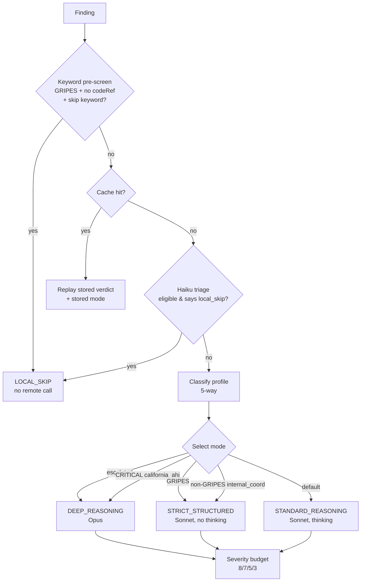

# Verification I: How We Decide to Check (Routing, Modes, Profiles, Triage)

A reviewer hands Spec Critic a folder of mechanical and plumbing specs, the
review pass comes back with two hundred findings, and now the program faces a
question that has nothing to do with whether any individual finding is *right*:
**which of these two hundred claims is worth paying to check?**

Checking is not free. Verification is the web-search-backed pass that adjudicates
a finding into a grounded verdict (the mechanics are [**Ch 10 — Verification II:
How We Check & Judge**](10_verification_grounding.md)), and every check spends real money and real time — a
verifier call on Opus with eight web searches and a full-page fetch is the most
expensive single operation in the entire pipeline. A leftover `TODO:` left in a
spec deserves none of that; it is self-evidently a defect and no amount of web
search will make it more or less true. A CRITICAL claim about a Title 24 seismic
anchorage requirement deserves the most expensive treatment the system can
offer, because being *confidently wrong* about that — the failure mode this whole
handbook circles back to — is worse than not checking at all.

This chapter owns the **decision layer** that sits between "we have a finding"
and "we make (or skip) a verification call." It is a cost-versus-coverage routing
problem, and Spec Critic's answer is a small stack of deterministic, pure-function
classifiers that turn each finding into one frozen record — a
`VerificationRoutingDecision` — encoding *whether* to check, *what kind* of claim
it is, *how hard* to think about it, and *how much* search budget to spend.
Chapter 10 takes that record and executes it. The clean seam between the two is
deliberate: routing is reproducible and inspectable; execution is where the
network, the model, and the grounding invariant live.

Five files carry the decision layer, each a leaf with a single job:

| File | Responsibility |
|---|---|
| `verification_prescreen.py` | `local_skip` vs `web_required` — the cheapest gate |
| `triage.py` | Haiku second opinion over what keywords couldn't resolve |
| `verification_profiles.py` | classify the *kind* of claim (5 profiles) |
| `verification_modes.py` | pick the *effort* (4 modes) and the priority order |
| `verification_routing.py` | assemble the full decision; build the request |

The web-search budget map itself lives one layer down in `api_config.py`
(`_SEVERITY_MAX_USES`), shared so the tool builder and the verifier read the same
numbers — full configuration ownership is [**Ch 12 — Configuration, Models &
Token Economics**](12_configuration_and_models.md).

## The shape of a decision

Before the individual classifiers, it helps to see the whole answer at once. For
any finding, routing resolves four nested questions:

1. **Do we web-search at all?** (the pre-screen, then triage)
2. **What kind of claim is it?** (the profile — sets which authoritative sources
   the verifier prompt prioritizes)
3. **How hard do we reason?** (the mode — model, thinking, escalation eligibility)
4. **How much search rope does it get?** (the budget — flat by severity)

That entire tree is a **pure function**. No LLM is consulted to pick a mode; the
inputs are the finding's text, its severity, a couple of booleans (escalated?
cache hit?), and the environment's configured model ids. Determinism is a feature
here, not an accident — a reviewer (or an auditor) can look at any finding and
predict exactly which treatment it got and why, and a unit test can pin the
routing of a synthesized finding without a network. The one exception is the
Haiku triage stage, which *does* make a model call — but its output is funneled
through the same hard safety gates as everything else, so even a misbehaving
classifier cannot widen the net.

The single record that comes out the other end is the `VerificationRoutingDecision`
— a frozen dataclass that names the chosen profile, mode, model, whether thinking
is enabled, the search budget, the continuation cap, escalation eligibility, the
cache phase, and a short `trace_reason` tag explaining which branch fired. We
will return to *why* that record exists as a single object in the last section;
for now, treat it as the deliverable this chapter produces.

## Stage 1 — The pre-screen: should we web-search at all?

The first and cheapest question is whether a finding needs external grounding at
all. `classify_finding_for_verification` answers it with a keyword classifier
that returns one of two strings — `"web_required"` (the default) or `"local_skip"`.
"Local skip" means *locally diagnosable; no web search would add signal* — a
leftover placeholder, a duplicate paragraph, a stray `lorem ipsum`. Web-searching
"is this paragraph a duplicate of that paragraph?" is absurd; the spec text
already settles it.

The classifier leads with two **hard gates**, in this order:

- **Any non-empty `codeReference` → `web_required`, unconditionally.** A finding
  that names a code section is, by definition, an external claim. It does not
  matter how editorial the surrounding text looks; if it cites `CMC 506.3`, it
  gets checked.
- **Anything above GRIPES severity → `web_required`.** Only the lowest severity
  bucket is eligible to skip. A MEDIUM/HIGH/CRITICAL finding always earns a check,
  even with no code reference.

Only after both gates pass does the classifier consult its keyword lists against
the finding's combined `issue` / `existingText` / `replacementText` text. The
main list, `_LOCAL_SKIP_KEYWORDS`, is deliberately conservative and reads like a
catalogue of the deterministic pre-screen's own output: `placeholder`, `[select]`,
`[verify]`, `tbd`, `todo`, `fixme`, `lorem ipsum`, `duplicate paragraph`,
`duplicate heading`, `empty section`, `invalid code cycle`, `template marker`,
`inconsistent filename`, and more.

That overlap is intentional and load-bearing. Every deterministic detector from
the local pre-screen ([**Ch 4 — Input: Extraction, Element IDs & the Deterministic
Pre-Screen**](04_input.md)) carries a stable `deterministic_rule` id, and those rule names are
*public* precisely so this list can recognize them. When the preprocessor has
already caught a duplicate paragraph locally — no model required — a GRIPES
finding describing that same duplicate should not then turn around and pay for a
Sonnet round-trip plus billable web searches to "verify" what a string comparison
already proved. The pre-screen and the local-skip classifier are two ends of one
idea: catch the locally-decidable defects without spending a token on them.

### The tightening story: why `"formatting"` had to go

The local-skip list is the program's most dangerous list, because *every keyword
on it is a license to skip verification entirely.* A too-broad keyword does not
produce a wrong answer the reviewer can see — it produces a *missing* check the
reviewer never knows happened. That asymmetry drove a deliberate tightening.

The word `"formatting"` used to be on the skip list, and it was removed. The
reason is a single concrete example the source comment preserves: a real CMC
requirement might read *"label valves per ASME A13.1 color formatting."* That is
not an editorial gripe — it is a genuine code-referencing requirement that
happens to contain the word "formatting." With `"formatting"` on the skip list, a
GRIPES-severity finding about that requirement would have matched, skipped
verification, and silently bypassed the one safety net that would have caught a
misstatement of the ASME A13.1 color scheme. Removing the keyword closes that
hole: such a finding now falls through to `web_required` and gets a (cheap) check
instead of no check.

It is worth being precise about *what* removing the keyword changed, because the
word `"formatting"` still appears elsewhere. It was removed only from the
pre-screen's **skip** list — the decision to make no call at all. It remains in
the *profile* classifier's internal-coordination keyword set (next section), which
only affects which priority-source language the verifier prompt uses and, for the
GRIPES case, routes the finding to the cheap STRICT_STRUCTURED mode. So the net
effect of the tightening is surgical: a GRIPES "formatting" finding went from
*skipped entirely* (zero searches) to *checked cheaply* (a no-thinking Sonnet pass
with up to three searches). The check got cheaper-but-real rather than absent.

### The elevated-confidence flag

Two other keywords — `"leed"` and `"internal contradiction"` — were handled
differently. They were *moved*, not removed, into a second list,
`_LOCAL_SKIP_KEYWORDS_REQUIRES_ELEVATED`. Findings matching these still route to
`local_skip` (web search genuinely adds no signal: whether a LEED reference is
inappropriate for a non-LEED project, or whether one passage contradicts another,
is decidable from the spec text alone). But they are flagged as a *residual-risk
class*. The model can locally diagnose *that* there's a problem; its confidence
about *which* text to edit is lower than for a dead-obvious placeholder.

So `local_skip_requires_elevated_confidence` returns `True` for a finding that
matched **only** the elevated list, and the resulting `VerificationResult` is
stamped with `requires_elevated_confidence=True`. Three properties of that flag
matter and are easy to get wrong:

- **It rides to the sidecar as telemetry, never to the cache.** A downstream
  applier (the future, separate program that actually edits documents — see the
  emit-but-don't-apply stance throughout this handbook) can read the flag from the
  edit sidecar and apply a higher bar before acting. But the flag never reaches
  the verification cache: local-skip results are ungrounded, and the cache refuses
  to persist ungrounded verdicts (the grounding guard is [**Ch 10**](10_verification_grounding.md)'s), so it
  drops them before the flag could ever be stored. No cache schema bump was needed.
  How the flag surfaces in the report and sidecar is [**Ch 11 — The Trust Model &
  Report Output**](11_trust_model_and_output.md)'s.
- **Matching both lists takes the regular path, no flag.** A finding that matches
  *both* a regular keyword (say `duplicate paragraph`) and an elevated keyword is
  treated as a regular skip with no flag. The regular-list match is the stronger
  signal — it maps directly to a deterministic detector — so the residual-risk
  concern, which only applies when the elevated keyword is the *sole* reason for
  the skip, doesn't fire.
- **Haiku-triaged skips never get the flag.** The flag is keyword-driven only.
  When the next stage — Haiku triage — decides a finding is locally resolvable, it
  stamps a plain local-skip result with no elevated flag, because the flag's whole
  meaning is "a specific keyword class with known residual risk," not "a model
  thought this was local."

## Stage 2 — Triage: a flexible second opinion

A keyword whitelist is fast and predictable, but blunt. The triage module's own
docstring gives the canonical miss: a finding like *"Section 2.2.B specifies 5 ft
pipe spacing but Section 4.1.A specifies 8 ft."* That is an internal contradiction,
fully verifiable from the spec text, with no `codeReference` — and it matches no
skip keyword. Under the keyword classifier alone it sails through to Sonnet plus
web search and comes back UNVERIFIED, having wasted the call. Web search was never
going to resolve an internal inconsistency.

`triage.py` adds a Haiku pass that classifies findings by their actual *content*
rather than a keyword list. Within the verification layer it is not gated by a
feature flag — it runs as an automatic third stage over whatever findings survive
the keyword and cache stages (gated only by the presence of an `ANTHROPIC_API_KEY`;
with no key the call short-circuits to an empty result and everything falls
through to `web_required`). Its model id is configurable via
`SPEC_CRITIC_TRIAGE_MODEL` but defaults to Haiku 4.5, which fits the shallow
"does this need the web?" classification over short inputs.[^triage-optin] Each
correct `local_skip` removes one Sonnet call plus up to a full severity budget of
billable searches, so the savings compound across a large run.

Triage earns the right to skip findings only because the **hard safety contract
is enforced outside the model call**, where Haiku cannot reach it:

- **Any non-empty `codeReference` → never eligible.** Code-citing findings always
  get web verification.
- **CRITICAL or HIGH severity → never eligible.** These drive go/no-go decisions
  in DSA review; they always get checked.
- **On any failure — API error, parse error, a hallucinated index, an unexpected
  exception — the affected findings default to `web_required`.** Failing safe is
  the entire design. The system prompt reinforces it from inside the model, too:
  *"When in doubt, choose `web_required`. A wrong `web_required` wastes a
  verification call; a wrong `local_skip` lets a real code error reach the
  report. Always err toward `web_required`."*

`is_eligible_for_haiku_triage` applies the first two gates *before* Haiku is
consulted, so the model only ever sees findings that could legitimately be
skipped. After the call, `filter_local_skips` re-applies the same eligibility
check as a defensive double-check, and the caller accepts results only for the
indices it actually sent — so a misbehaving classification dict can never cause a
CRITICAL or code-citing finding to be skipped, no matter what comes back. The
asymmetry of the two error directions is the whole philosophy: a wasted check
costs a few cents; a missed check costs trust.

## Stage 3a — Profiles: what kind of claim is this?

Once a finding has earned a web check, the next question is *what kind* of claim
it makes, because different claims have different authoritative sources. A
California Title 24 amendment is best checked against California regulators; an
NFPA edition question against the standards body; a manufacturer model number
against the manufacturer's datasheet. `classify_finding_profile` answers this with
a five-way keyword classifier over the finding's `codeReference`, `issue`,
`existingText`, `replacementText`, and `section`.

| Profile | When |
|---|---|
| `california_ahj` | mentions California / DSA / HCAI / OSHPD / Title 24 / CALGreen / AHJ |
| `code_standard` | cites a code section or standards body (CBC/NFPA/ASHRAE/…) without California signals |
| `manufacturer` | mentions a manufacturer / model number / datasheet / submittal / "or approved equal" |
| `constructability` | default for substantive technical claims with no clear kind signal |
| `internal_coordination` | mentions internal contradiction / placeholder / LEED / typo / duplicate / formatting |

The **priority order** is what makes the classifier well-defined when a finding
trips multiple keyword sets, and it runs:

1. **`internal_coordination`** — checked *first*. A finding with these signals
   never needs external grounding regardless of any other text, so it short-circuits
   ahead of everything.
2. **`california_ahj`** — before generic code-standard, because California
   amendments *add* constraints to model codes; a "CBC + DSA" finding must be
   treated as a California claim, not a generic one.
3. **`manufacturer`**.
4. **`code_standard`** — or any non-empty `codeReference`, the single most
   reliable signal (a finding that names a section is a code claim by definition).
5. **`constructability`** — the last-resort default.

The single most important thing to understand about profiles is what they do
*not* control: **the profile sets the priority-source language in the verifier's
system prompt; it does not set the search budget.** The budget is severity-based
and identical across all five profiles (next section). A CRITICAL manufacturer
finding and a CRITICAL California finding both get eight searches; what differs is
*which sources the prompt tells the verifier to reach for first.*

The profile classifier also does something subtler that connects it back to the
pre-screen. The keyword pre-screen's `local_skip` only fires for GRIPES. But an
*internal contradiction* can be HIGH severity — and a HIGH finding can't be
local-skipped. The `internal_coordination` profile extends the same "this is
internally decidable" logic to those higher-severity findings: a HIGH internal
contradiction classifies as `internal_coordination`, which (as the next sections
show) routes it to the cheap STRICT_STRUCTURED mode rather than the full
STANDARD_REASONING treatment. The two layers cooperate — the pre-screen skips the
GRIPES subset entirely; the profile throttles the higher-severity remainder to the
cheapest mode that still makes a call.

A note on honesty, because the handbook owes it. This is a keyword classifier, and
keyword classifiers are brittle by nature. The `manufacturer` set includes common
boilerplate like `"or approved equal"` and `"equal to"` that appears in specs that
aren't really about a manufacturer at all; a misclassification here picks the wrong
priority-source paragraph for the prompt. The source is candid that this is
acceptable: *"A wrong classification at worst picks the wrong priority-source
paragraph; the grounding invariant … is the real safety net."* Profile is a
*hint* to the verifier, not a gate on truth. The thing that actually prevents a
wrong verdict — the requirement that every CONFIRMED/CORRECTED be backed by a real,
retrieved citation — lives in [**Ch 10**](10_verification_grounding.md), and it does not care which profile the
finding was tagged with.

[^profile-drift]: A drift worth flagging in the spirit of this handbook's
conflict rule (source code wins over docs and comments). A module-level comment in
`verification_profiles.py` describes the order as "California first … then
internal-coordination." The *executable* `classify_finding_profile` — and its own
function docstring, and `CLAUDE.md` §3 — check **internal-coordination first**,
then California. The function is authoritative; the older module comment is stale.

## Stage 3b — Search budget: how much rope?

The web-search budget is a flat function of **severity alone**, identical across
every profile:

| Severity | `web_search` `max_uses` |
|---|---|
| CRITICAL | 8 |
| HIGH | 7 |
| MEDIUM | 5 |
| GRIPES | 3 |

The numbers live in one place — `_SEVERITY_MAX_USES` in `api_config.py` — and
both the web-search tool builder and the verifier read them through the same
helper, `web_search_max_uses_for_severity`. The profile-facing entry point,
`profile_max_uses`, *accepts* a profile argument purely for call-site
compatibility and then ignores it (`del profile`), delegating straight to the
severity map. This is a small but deliberate piece of anti-drift engineering: the
profile parameter exists so older call sites don't break, but it can never cause
the budget to diverge from severity, because the function physically discards it.

Why flat, rather than a richer per-profile budget? Because the safeguards that
keep a low-signal finding from burning its budget are not *budget* limits — they
are the grounding invariant and the internal-coordination prompt guidance. The
program doesn't need a separate budget tier per kind of claim; it needs high-stakes
claims to get more rope and editorial gripes to get less, and one severity map
delivers exactly that. An unknown severity falls back to a sensible default (5),
so a misclassified finding still gets a reasonable allowance rather than zero.

## Stage 3c — Modes: how hard do we think?

The mode bundles the remaining decisions — model, whether to enable extended
thinking, whether to attach `web_fetch`, and whether the finding is eligible to
escalate — into one of four values. The full policy table, reproduced from
`CLAUDE.md` §3 and matching `verification_modes.mode_policy` exactly:

| Mode | When | Model | Thinking | Search budget | web_fetch | Escalates? |
|---|---|---|---|---|---|---|
| `local_skip` | keyword classifier or Haiku triage said `local_skip` | (none — `"local"` sentinel) | n/a | 0 | no | no |
| `strict_structured` | GRIPES, **or** non-GRIPES `internal_coordination` profile | Sonnet | off | severity-based | no | no |
| `standard_reasoning` | default for substantive technical claims | Sonnet | on | severity-based | yes (3 fetches) | yes |
| `deep_reasoning` | escalated, **or** initial pass for CRITICAL `california_ahj` | Opus | on | severity-based | yes (3 fetches) | no (terminal) |

The selector, `select_verification_mode`, applies its rules in a strict **priority
order**. Reproducing it exactly, because the order is the whole behavior:

1. **Cache-hit replay.** If the caller passes a `cached_mode` (the cache returned
   a stored verdict for an identical claim), that mode is preserved verbatim so the
   replayed result carries its original routing tag rather than being relabeled.
2. **`local_skip` wins outright.** If the upstream classifier or triage said "no
   web verification needed," nothing downstream overrides it → `LOCAL_SKIP`.
3. **Escalated → `DEEP_REASONING`.** Once we're on the second pass after a failed
   attempt, we're committed to Opus regardless of what severity or profile would
   have picked initially.
4. **CRITICAL + `california_ahj` → `DEEP_REASONING`** on the *initial* pass. (More
   on why below.)
5. **GRIPES (any profile that isn't internal-coordination) → `STRICT_STRUCTURED`.**
   The editorial tail that slipped past local-skip — typically a GRIPES with a
   non-empty `codeReference` — doesn't need deep reasoning.
6. **Non-GRIPES `internal_coordination` → `STRICT_STRUCTURED`.** The HIGH internal
   contradiction from the previous section lands here.
7. **Default → `STANDARD_REASONING`.** The workhorse for substantive MEDIUM-and-up
   technical claims across the code-standard / manufacturer / California /
   constructability profiles.

Two mechanics inside that table deserve a closer look.

**`web_fetch` is enabled for STANDARD_REASONING and DEEP_REASONING only.** The
tool list is assembled in `build_verification_tools_from_decision`, which appends
the `web_fetch` server tool — the companion to `web_search` that pulls the full
text of a previously-seen URL when a search snippet isn't enough — for exactly
those two modes. STRICT_STRUCTURED and LOCAL_SKIP omit it: STRICT_STRUCTURED is
cheap-and-narrow by design, and LOCAL_SKIP makes no remote call at all. (Web fetch
is generally available and takes **no** beta header — a once-attached
`web-fetch-2026-02-09` header crashed the common verification path with an HTTP
400; the full cautionary tale is [**Ch 10 — Verification II**](10_verification_grounding.md) and [**Ch 17 —
Evolution & Lessons**](17_evolution_and_lessons.md).) One ordering detail matters for prompt caching: the verdict
tool stays at the *end* of the tool list so `tools_with_cache` attaches the
trailing cache breakpoint to the right place — the byte-stability of cache
breakpoints is a recurring concern across the codebase.

**CRITICAL California findings jump straight to Opus.** Rule 4 is the one place
the initial pass skips Sonnet entirely. The reasoning is a direct cost win
disguised as an extravagance: the ambiguity surface for a CRITICAL
California-specific claim — Title 24 amendments layered on a model code, DSA/HCAI
nuance, local AHJ interpretation — is wide enough that a Sonnet first pass will
*usually* fail to ground and escalate to Opus anyway. Paying for the Sonnet call
first, only to redo it on Opus, is pure waste. Jumping straight to DEEP_REASONING
spends one expensive call instead of one cheap-then-one-expensive.

### Escalation as policy

Escalation — re-running an uncertain finding on the stronger model (Sonnet → Opus)
— is where the decision layer and the execution layer meet, and the line between
them is worth drawing carefully. This chapter owns the *policy*: which findings
are *eligible* to escalate, and the fact that escalation forces DEEP_REASONING.
[**Ch 10**](10_verification_grounding.md) owns the *execution*: how the escalation call actually runs, and how a
disagreement between the two verifiers becomes a "contested" result.

Two gates govern eligibility, both in this layer. First, at the mode level, only
`STANDARD_REASONING` is escalation-eligible (`allows_escalation=True`);
STRICT_STRUCTURED is too low-stakes, LOCAL_SKIP makes no call, and DEEP_REASONING
is already at the top of the ladder — it is *terminal* and does not escalate
further. Second, `should_escalate_verification` adds the content gates: escalation
fires only for CRITICAL/HIGH findings (the high-stakes severities that drive
go/no-go decisions), and only when the first pass actually fell short — an
UNVERIFIED verdict, an ungrounded verdict, or a pass where every search errored
and nothing usable came back. And it short-circuits to "no escalation" entirely
when the initial verifier *is already* the escalation model (an operator who has
pointed both env vars at Opus gets no redundant second pass). When all of that
lines up, the escalated re-run is routed by passing `escalated=True` back through
`select_routing`, which trips rule 3 above and forces DEEP_REASONING on Opus.

The continuation cap travels in the decision too: `max_continuations` is 2 for
every mode except DEEP_REASONING, which gets 4 so a legitimately hard CRITICAL
California finding has room to converge across pause-turn rounds. The continuation
*loop* that consumes that cap is [**Ch 10**](10_verification_grounding.md)'s.

## One decision object, four callers

Everything above produces a single `VerificationRoutingDecision`, and the reason
it exists as one frozen object — rather than a handful of values each caller
computes for itself — is a real bug the codebase lived through.

Verification runs on four code paths: the real-time streaming call, the batch
initial submission, and the batch retry and continuation builders (the batch
transport itself is [**Ch 6 — Batch Processing**](06_batch_processing.md)). The routing decision used to be
re-derived independently in three of them, and they drifted. The batch initial
path applied a thinking config unconditionally and used the profile budget
*without* the mode's adjustment — so a GRIPES finding that would have been
STRICT_STRUCTURED (Sonnet, no thinking) in real time ran through the batch path as
STANDARD_REASONING (Sonnet, thinking on, full budget), and then the wave parser
*re-stamped* the result as STRICT_STRUCTURED, labeling it as something different
from what the request had actually sent. The telemetry lied because the decision
wasn't centralized.

The fix is the one-source-of-truth pattern that recurs throughout Spec Critic:

- **`select_routing`** is the single pure-function selector. Given a finding plus
  the escalation/cache hints, it returns the fully-populated decision. It delegates
  mode selection to `select_verification_mode` so the priority order lives in one
  place, applies the model override / capability gates, looks up the severity
  budget, and resolves the continuation cap.
- **`build_verification_request`** is the single request builder. It consumes a
  decision and the rendered prompt strings and produces the kwargs the SDK accepts
  — the same function backs all four paths. It even refuses to build a request for
  a `local_skip` decision (raising rather than silently producing a useless call),
  because a local-skip finding should have short-circuited long before this point.
- **`apply_routing_to_result`** stamps the routed mode/profile/escalation flag
  onto the result, so the real-time path and the batch wave parser apply *identical*
  telemetry — the parser reconstructs the decision from the stored request context
  (the decision is JSON-round-trippable via `to_dict`/`from_dict`) and stamps the
  same record the request was built with.

The decision also carries a short `trace_reason` tag — `local_skip`,
`cached_mode_replay`, `escalated_to_deep`, `critical_california_ahj_initial_deep`,
`gripes_strict_structured`, `internal_coordination_strict`,
`default_standard_reasoning` — so a diagnostics dump can bucket findings by *why*
they were routed the way they were, without parsing free text. That observability
hook feeds [**Ch 14 — Observability: Tracing & Diagnostics**](14_observability.md).

## Predicting the routing: worked examples

The quality bar for this chapter is that a reader can predict, for a given
finding, which mode/model/budget it gets and why. Here is the decision layer run
forward over a representative spread:

| Finding (severity, text) | Pre-screen | Profile | Mode → model | Budget | Why |
|---|---|---|---|---|---|
| GRIPES, "`TODO:` finish this section" | `local_skip` | — | `LOCAL_SKIP` → none | 0 | keyword + GRIPES + no codeRef; the preprocessor already caught it |
| GRIPES, "label valves per ASME A13.1 color formatting" | `web_required` | internal_coord | `STRICT_STRUCTURED` → Sonnet (no thinking) | 3 | "formatting" no longer skips; GRIPES → strict |
| MEDIUM, "NFPA 13 requires 130 ft² sprinkler coverage" | `web_required` | code_standard | `STANDARD_REASONING` → Sonnet (thinking) + fetch | 5 | default workhorse for MEDIUM-and-up technical claims |
| HIGH, "Internal contradiction: 2.2.B specifies 5 ft, 4.1.A specifies 8 ft" | `web_required` (HIGH) | internal_coord | `STRICT_STRUCTURED` → Sonnet (no thinking) | 7 | HIGH can't local-skip *and* is triage-ineligible; internal_coord → strict (still a web call) |
| CRITICAL, "Title 24 / DSA seismic anchorage detail missing" | `web_required` | california_ahj | `DEEP_REASONING` → Opus (thinking) + fetch | 8 | CRITICAL + California jumps straight to Opus; terminal |
| HIGH, "CMC 506 grease duct clearance understated" (UNVERIFIED on first pass) | `web_required` | code_standard | initial `STANDARD_REASONING`; then `DEEP_REASONING` → Opus | 7 | escalation: HIGH + UNVERIFIED forces deep re-run |

Notice the fourth and fifth rows together: a HIGH internal contradiction and a
CRITICAL California claim diverge completely even though both "could be wrong in a
way that matters," because the *kind* of claim (internal vs external) and the
severity together pick radically different effort. That divergence is the entire
point of the decision layer — spend Opus and eight searches where the ambiguity
and stakes justify it, and a cheap no-thinking Sonnet pass (or nothing at all)
where they don't.

## Design tensions and honest edges

- **Keyword classifiers are brittle, and the design accepts it for profiles but
  not for skipping.** The asymmetry is principled: a wrong *profile* costs a
  suboptimal priority-source paragraph that the grounding invariant backstops; a
  wrong *skip* costs a missing check that nothing backstops. So the profile
  classifier is allowed to be approximate, while the skip list is conservative,
  was actively tightened (the `"formatting"` story), and is wrapped in hard
  gates. The lists are still hand-maintained, though, and a genuinely novel phrasing
  can slip past both the keyword skip and the keyword profile — which is exactly
  why the Haiku triage stage exists, and why even *it* fails safe to `web_required`.
- **Triage spends a model call to save model calls.** It is a bet that a cheap
  Haiku classification, in aggregate, removes more Sonnet+search cost than it adds.
  The bet is hedged entirely on the safe side: the eligibility gates keep it away
  from anything high-stakes, and every failure mode collapses to "just check it."
- **`local_skip` results are never grounded — and that is correct.** A skipped
  finding carries no citation because none was sought, which is why such results
  can't be cached and why the `requires_elevated_confidence` flag can only ever be
  telemetry. The trust model handles this by giving these findings their own
  status, `LOCALLY_CLASSIFIED`, rather than dressing them up as "verified"
  ([**Ch 11**](11_trust_model_and_output.md)). The honest statement to the reviewer is "we resolved this locally,"
  not "we confirmed this against the world."
- **The stale module comment** in `verification_profiles.py` (footnote above) is a
  small live example of the drift this handbook's conflict rule is designed to
  catch: the code does one thing, an old comment claims another. The executable
  function is authoritative.

## How this connects

- **Upstream — what feeds the decision.** The `deterministic_rule` ids whose names
  the local-skip list recognizes come from the pre-screen in [**Ch 4 — Input:
  Extraction, Element IDs & the Deterministic Pre-Screen**](04_input.md). The `Finding` fields
  the classifiers read (`severity`, `codeReference`, `issue`, `existingText`,
  `replacementText`) are shaped by [**Ch 5 — The Review Engine**](05_review_engine.md). The pre-pass that
  invokes these classifiers in order — keyword skip, cache lookup, Haiku triage —
  is wired into the verification spine in [**Ch 7 — Orchestration & State**](07_orchestration.md) and
  [**Ch 10 — Verification II**](10_verification_grounding.md).
- **Downstream — what executes the decision.** The verification *call* itself,
  grounding, verdict parsing, the escalation *run*, contested detection, budget-
  exhaustion detection, the continuation loop, the real-time fallback, and the
  cache all belong to [**Ch 10 — Verification II: How We Check & Judge**](10_verification_grounding.md). This
  chapter decides the policy; Ch 10 carries it out.
- **Sideways — transport.** All four request paths ship through the Message
  Batches backbone (or the real-time stream) of [**Ch 6 — Batch Processing**](06_batch_processing.md), which
  carries the built `params` as an opaque body.
- **Configuration.** The severity budget map, the model ids, the capability
  whitelist, and the env overrides (`SPEC_CRITIC_TRIAGE_MODEL`,
  `SPEC_CRITIC_VERIFICATION_MODEL`, `SPEC_CRITIC_VERIFICATION_ESCALATION_MODEL`)
  are [**Ch 12 — Configuration, Models & Token Economics**](12_configuration_and_models.md).
- **Presentation.** How a `local_skip` finding renders as `LOCALLY_CLASSIFIED`,
  and how the `requires_elevated_confidence` telemetry surfaces in the edit
  sidecar, are [**Ch 11 — The Trust Model & Report Output**](11_trust_model_and_output.md). The `trace_reason`
  tags feed [**Ch 14 — Observability: Tracing & Diagnostics**](14_observability.md).

## Key takeaways

- **The whole layer answers four nested questions** — check at all? what kind?
  how hard? how much budget? — and resolves them into one frozen
  `VerificationRoutingDecision`. It is a pure function (save the Haiku stage), so
  routing is reproducible and inspectable.
- **The cheapest gate runs first.** The keyword pre-screen skips only GRIPES
  findings with no `codeReference` that match a conservative local-skip list; any
  `codeReference` or any severity above GRIPES forces `web_required`.
- **The skip list is the dangerous list, and it was tightened.** `"formatting"`
  was removed (a real ASME A13.1 requirement could have hidden behind it);
  `"leed"`/`"internal contradiction"` were moved to an elevated-confidence list
  that still skips but flags residual risk as sidecar-only telemetry.
- **Triage is the flexible second opinion, and it fails safe.** A Haiku pass
  catches content-based local skips that keywords miss, but code-citing and
  CRITICAL/HIGH findings are never eligible and every error defaults to
  `web_required`.
- **Profiles set source language; severity sets budget.** Five profiles
  (internal-coordination checked first, then California, manufacturer,
  code-standard, constructability default) pick the verifier's priority sources;
  the flat severity budget (8/7/5/3) is identical across them and lives in one map.
- **Four modes scale effort, in a strict priority order.** `local_skip` →
  `strict_structured` (Sonnet, no thinking) → `standard_reasoning` (Sonnet,
  thinking, escalation-eligible, `web_fetch`) → `deep_reasoning` (Opus, terminal,
  `web_fetch`). CRITICAL California claims jump straight to Opus; `web_fetch` rides
  STANDARD/DEEP only.
- **One selector, one builder, four callers.** `select_routing` and
  `build_verification_request` exist so real-time, batch-initial, retry, and
  continuation paths can never drift apart — a lesson learned from a real bug where
  the batch path silently disagreed with the telemetry it stamped.

[^triage-optin]: `CLAUDE.md`'s source-file map previously labeled `triage.py`
"(opt-in)"; it now labels it "(automatic; needs API key)," matching the code. In
the verification layer as wired today there is no dedicated on/off switch: triage
runs automatically as the third stage of the local-resolution pre-pass whenever
findings survive the keyword and cache stages and an API key is present. Only its
model id is configurable. Described here as the code behaves.
