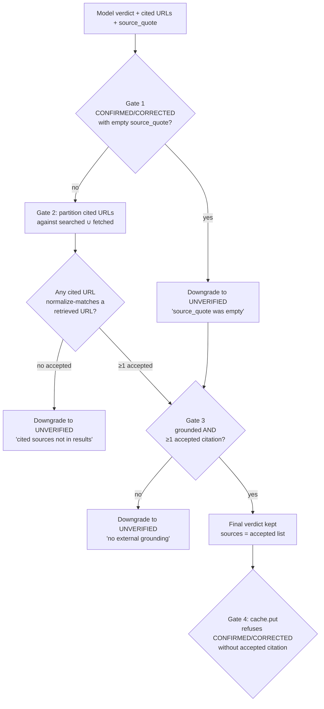
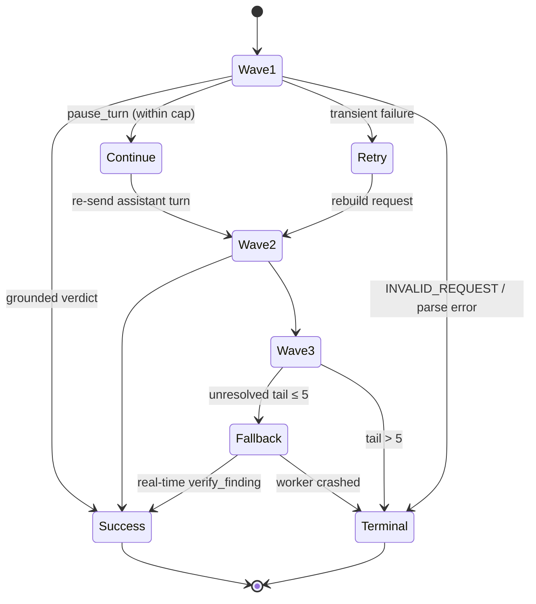

# Verification II: How We Check & Judge (Grounding, Verdicts, Escalation, Cache)

A reviewer trusts a tool the way they trust a junior engineer: not because it is
always right, but because it knows the difference between *I checked this* and *I
think this is true*, and it never blurs the two. Everything in the previous
chapter — profiles, modes, budgets, triage — was about deciding *which* findings
earn a real check. This chapter is about what happens when the check actually
runs: the web-search-backed call, the judgment of what came back, and the one
machine that stands between a plausible-sounding hallucination and the word
"VERIFIED" in a compliance report.

That machine is **grounding**, and it is the immune system of the whole program.
A spec-review tool that confidently cites a building code it invented is not a
flawed tool; it is a dangerous one, because its confidence is exactly what makes
a reviewer stop double-checking. So the verifier is built on a single, blunt
principle: *a verdict may not call itself confirmed unless it can point to a URL
the search tool actually retrieved.* Not a URL the model believes exists — a URL
the API returned. Everything else in this chapter is plumbing in service of that
sentence, and one honest caveat (§"The caveat that matters most") about exactly
how far it does, and does not, go.

Four files carry the work, each owned by this chapter:

| File | Responsibility |
|---|---|
| `verifier.py` (~3,175 lines) | the verification call, the parser, real-time + batch waves, escalation, the result model |
| `source_grounding.py` | URL normalization and the searched/cited/accepted/rejected partition |
| `verification_cache.py` | the claim-keyed verdict cache and its persist-refusal guards |
| `retry_policy.py` | the failure taxonomy that decides retry vs. continue vs. give up |

The routing *decision* this chapter executes — which model, which mode, how much
search budget — was built in **Ch 9 — Verification I: How We Decide to Check**.
The clean seam between the two is deliberate: Ch 9 is a pure function you can
unit-test without a network; Ch 10 is where the network, the model, and the
grounding gate live.

## What the verifier sends

A single verification is one focused conversation. The system prompt
(`_get_verification_system_prompt`) casts the model as "a construction
specification verification assistant for California K-12 DSA projects" and tells
it the rules of the house: *use web search before rendering a verdict; do not
speculate; do not invent URLs; leave sources empty if reliable references are
unavailable.* It then hands the model the current code cycle (CBC, CMC, CPC,
Energy Code, CALGreen, ASCE 7), followed by a **pinned standards editions** block
built by `_pinned_standards_lines` — the specific NFPA, ASHRAE, IAPMO, and UL
editions California adopted for the cycle, with an explicit instruction: *use the
edition listed here; if a search result shows a different edition, flag the
difference and treat the pinned edition as authoritative.* (The edition *data*
itself lives on the `CodeCycle` and is owned by **Ch 12 — Configuration, Models &
Token Economics**; this chapter owns only the prompt's *use* of it.) Empty
edition fields are silently dropped, so a future cycle that hasn't been populated
degrades to an empty block rather than claiming a pinning that isn't there.

Below that sits a ranked source-priority list — California regulatory authorities
(`dgs.ca.gov`, `dsa.ca.gov`, `hcai.ca.gov`…) first, then code publishers,
standards bodies, testing labs, manufacturers, and finally archived standards —
and a CRITICAL instruction about the `source_quote` field that turns out to be a
grounding gate in disguise (more below). The user prompt (`_build_verification_prompt`)
wraps the finding's fields in XML data blocks via the `prompt_serialization`
helpers, so a finding whose `issue` text happens to contain `</finding>` cannot
break out of its wrapper and inject instructions — a low-effort hedge against
prompt injection from spec content.

Two facts about the call shape are load-bearing. First, **it must stream.** The
`web_search` server tool only works over `client.messages.stream(...)`; a plain
`messages.create()` fails with a "streaming is required" error. Second, the
prompt and the request are built so they *cannot disagree* about which tools
exist: a single `include_verdict_tool` flag is threaded into both the prompt
builder and the request builder, so the prompt never advertises a
`submit_verification_verdict` tool the request omits, or vice versa.

### One parser, every path

A verification result can arrive from four different places — the real-time
initial call, a batch initial wave, a batch retry wave, a batch continuation
wave — and every one of them funnels through a single canonical parser,
`parse_verification_response`. Its precedence is fixed: try the structured
`submit_verification_verdict` tool input first (searching messages in reverse so
the most recent verdict wins across continuations), fall back to strict JSON
in the concatenated text, and finally report `no_content` when neither yields a
verdict. A separate helper, `classify_verification_stop_reason`, collapses
`tool_use` and `end_turn` into a single `complete` class so the real-time loop
and the batch wave agree on what "the model finished" means. The two are split
deliberately: the *parse* is identical everywhere, but the right *response* to a
`pause_turn` differs — real-time resumes inline; the batch path schedules a
follow-up wave.

This single-parser discipline is why batch and real-time produce byte-identical
verdicts for byte-identical responses, and it is the foundation for the grounding
parity the audit demanded (§"Batch parity").

## The grounding invariant — the heart of the chapter

When the model returns `CONFIRMED`, the verifier does not believe it. It makes
the model prove it, through a stack of four gates that a verdict must clear
before the word "verified" survives. Each gate fails *closed* — the safe
direction is always to downgrade toward `UNVERIFIED`.



**Gate 1 — the source quote (parse time).** The system prompt demands that any
`CONFIRMED`/`CORRECTED` verdict carry `source_quote`: the verbatim snippet text
the model says it read. `_demote_if_missing_source_quote` runs at parse time and
downgrades any confirmed verdict that arrives with an empty quote to `UNVERIFIED`.
The reasoning is an audit trail: without the quote, the report has no way to show
a reviewer *which sentence* the verdict rests on. A confirmed verdict with no
quotable evidence is, by construction, not grounded.

**Gate 2 — the source partition (`_apply_source_grounding`).** This is the core.
The helper takes the model's cited URLs and the URLs the API actually retrieved,
and partitions them into four sets:

- `searched_sources` — every URL the `web_search` tool returned (deduped).
- `cited_sources` — every URL the model put in its verdict payload.
- `accepted_sources` — cited URLs whose *normalized* form appears in the searched
  (or fetched) pool.
- `rejected_sources` — cited URLs that matched nothing, each tagged with a reason
  (`ungrounded` / `malformed` / `empty`).

Then comes the move that makes the whole thing trustworthy: the public `sources`
list is *replaced* with only the accepted citations. **`VerificationResult.sources`
is the accepted list, not the cited list.** A URL the model invented cannot
normalize-match anything the API returned, so it lands in `rejected_sources`, is
shown to the reviewer as evidence that was *not* accepted, and never appears as a
"source." And if the model emitted `CONFIRMED` with citations but *every* one was
ungrounded, the verdict itself is downgraded to `UNVERIFIED` on the spot.

**Gate 3 — the defensive invariant (`_enforce_grounding_invariant`).** This is
belt-and-suspenders. It catches two cases Gate 2 might miss: a verdict that is
`CONFIRMED` but `grounded=False` (no usable search evidence at all), and a verdict
that is grounded but cited *nothing* (so there is nothing to accept). Either way,
it rewrites the verdict to `UNVERIFIED` and appends a human-readable reason to the
explanation. Every UNVERIFIED the real-time path constructs flows through this
function too (via `_make_unverified`), so the invariant is impossible to skip.

**Gate 4 — the cache refuses to store violations (`VerificationCache.put`).**
Even if a future call site somehow constructed a source-less `CONFIRMED`
directly, the cache will not persist it — it refuses any `CONFIRMED`/`CORRECTED`
that lacks an accepted citation, and the load path re-checks the same condition
when reading from disk. The trust property is enforced at write *and* read.

There is a fifth, independent re-check in `report_status.classify_status`
(**Ch 11 — The Trust Model & Report Output**), which re-derives grounding before
it will paint a finding `VERIFIED_SUPPORTED`. The trust audit verified this whole
chain — conservative normalization, exact match, fabricated URLs can't match,
plus the independent re-check — as genuine defense-in-depth, and it is the
codebase's most-scrutinized path.

### How a URL is matched

The matching itself lives in `source_grounding.py`, and its design philosophy is
*conservative*: be lenient enough that a real citation isn't rejected over
cosmetic noise, strict enough that two genuinely different pages never collapse
into one. `normalize_url` folds `http`/`https` to `https`, lowercases the host,
strips default ports, drops a single trailing slash, removes the fragment, sorts
query parameters and strips a small allow-list of tracking tags (`utm_*`,
`gclid`, `fbclid`…), and peels trailing punctuation and angle brackets off URLs
the model wrapped in prose. It deliberately does *not* touch path segments or
meaningful query values — `?page=2` and `?page=3` stay distinct. `validate_cited_sources`
then does an exact set-membership test on the normalized forms, returning
accepted citations in their *original* model-supplied spelling so the report
renders what the model actually wrote. If the searched set is empty, every
citation is rejected: with nothing retrieved, there is nothing to validate
against.

### Batch parity

This matters more than any other single fact in the chapter, because **the batch
wave is the default, highest-volume path**, and the trust audit flagged it
explicitly (P0-5): *prove* that the batch path grounds verdicts exactly as the
real-time path does, rather than assuming it "mirrors" it. It does. Inside
`_classify_wave_results`, a successful batch result runs the identical sequence
— `parse_verification_response`, then `_apply_source_grounding(searched, fetched)`,
then `_enforce_grounding_invariant`, then the same budget-exhaustion stamp — using
the same helpers the real-time path calls. A batch `CONFIRMED` with an ungrounded
citation is downgraded to `UNVERIFIED` identically. There is no second
implementation to drift; both paths call the same functions.

## The caveat that matters most

Here is the single most important sentence in this chapter, and it is a limit,
not a feature:

> **Grounding proves the cited source was actually retrieved by the search tool.
> It does not prove that the retrieved page's content actually supports the
> specific code claim.**

The model could cite a real, retrieved page — one that genuinely came back from
`web_search` — that does not, in fact, contain the provision the finding is
about. Automated grounding proves *the source is real*; it does not prove *the
source proves the claim*. The `source_quote` gate narrows this gap (the model
must paste a verbatim snippet, which a reviewer can eyeball), but it does not
close it: the model still chooses which snippet to quote and asserts that it
supports the verdict. That semantic link — *this passage establishes this
requirement* — is the model's judgment, not a verified fact.

The honest consequence, which the trust audit (**Ch 16 — Trust Under the
Microscope**) states plainly and which this handbook will not soften: **human
spot-checking of `VERIFIED_*` findings is still warranted.** Grounding raises the
floor — it eliminates the confidently-invented citation, which is the most
dangerous failure mode — but it is not a substitute for a licensed reviewer
reading the cited section. The program is designed to make uncertainty *visible*,
not to abolish it, and pretending grounding is stronger than it is would betray
the entire trust throughline.

## web_fetch: a deeper read, and a cautionary tale

A search snippet is sometimes not enough — it shows a section heading or a clause
list but not the requirement text itself. For those cases the verifier can reach
for `web_fetch`, a server tool that retrieves the *full* text of a URL that
already appeared in a prior search result. It is attached only to the two
reasoning modes that benefit (STANDARD_REASONING and DEEP_REASONING); the cheap,
narrow modes (STRICT_STRUCTURED, LOCAL_SKIP) omit it by design.

Fetched pages join grounding as first-class evidence. `_apply_source_grounding`
validates citations against the **union** of searched and fetched URLs (`searched
∪ fetched`), so a model that fetches a page and cites a URL from it grounds
correctly even if that URL never appeared in a snippet. But fetched URLs are kept
*off* `searched_sources` — they ride a separate `fetched_sources` list and render
in the report under a distinct "Full-text sources consulted" sub-section, so a
reviewer can tell snippet-grounded evidence from fetch-grounded evidence at a
glance. Telemetry (`web_fetch_requests`, `fetched_sources`) round-trips through
the cache so a replayed hit shows the same "Searches: N, Full-page fetches: M"
line.

Now the cautionary tale, because it is the chapter's sharpest lesson about
trusting "harmless" defaults. **`web_fetch` is generally available and takes no
`anthropic-beta` header.** The code originally shipped attaching
`extra_headers={"anthropic-beta": "web-fetch-2026-02-09"}` on the comfortable
assumption that the header was "harmless if the API treats web_fetch as GA,
required if it's still gated." That reasoning was wrong on *both* counts: web_fetch
is GA (the tool dict alone enables it), and an *unrecognized* `anthropic-beta`
value is not silently ignored — it is rejected with HTTP 400. So every
verification routed to STANDARD/DEEP — the common path — carried a retired header
and crashed the run at submit. The fix in `build_verification_request` is to
attach **no** beta header for web_fetch; `extra_headers` is left as an empty dict.

That empty dict looks like dead code, and it is worth one sentence on why it
stays: `extra_headers` is the SDK *transport* seam (real HTTP headers), kept
separate from the request `params` because the **batch API rejects unknown keys
inside per-item `params`**. Bundling a header into the body would itself trigger
`invalid_request_error`. So the seam survives — empty — purely so the real-time
and batch paths that forward it stay structurally identical. The lesson
generalizes to a whole *risk class*: a hardcoded beta header is a time bomb that
fires when the value retires. The still-live `output-300k-2026-03-24` header on
the extended-output batch path (**Ch 6 — Batch Processing**) is the same class of
risk, and the audit names it as the next one to watch.

## Escalation and the contested verdict

When Sonnet runs a CRITICAL or HIGH finding and comes back ungrounded, the
program does not shrug. It escalates: re-runs the same finding on Opus, the
stronger model. Whether to escalate is a *policy* decision owned by
`should_escalate_verification` in **Ch 9**; this chapter owns the *run*.

The mechanics have one subtlety worth dwelling on, because it is the difference
between a useful signal and a misleading one. Before the escalation call can
replace the result object, `verify_finding` **snapshots** the initial verdict,
model, grounding state, and accepted sources:

```python
initial_grounded_snapshot = bool(result.grounded)
initial_sources_snapshot = list(result.sources or [])
# ... escalation call may now overwrite `result` ...
result = _apply_escalation_outcome(initial_result=result, esc_result=esc_result, ...)
```

`_apply_escalation_outcome` is the single source of truth for the merge, shared by
the real-time path and the batch escalation wave so they cannot drift. It keeps
the escalated result when Opus grounded a verdict (or turned an initial
`UNVERIFIED` into a substantive verdict), otherwise it keeps the first pass so no
evidence is lost. Then it stamps the telemetry — and computes the field that
earns its own report status:

```python
result.models_disagreed = (
    initial_grounded and bool(esc_result.grounded)
    and esc_result.verdict != initial_verdict
)
```

This is **strictly tighter** than `escalation_changed_verdict` (which fires
whenever the final verdict differs from the initial, regardless of grounding). An
initial-`UNVERIFIED`-then-`CONFIRMED` escalation *changed the verdict* but is not
a *disagreement* — the first pass never grounded anything to disagree about; the
escalation was simply doing its job. `models_disagreed` fires only when **both
verifiers grounded their verdicts** (each with a real accepted citation) **and
reached different conclusions.** When it does, `classify_status` short-circuits
the finding to `VERIFIED_CONTESTED` (**Ch 11**) *before* the verdict branches, so
a swapped-in grounded `CONFIRMED` that contradicts a grounded `DISPUTED` initial
does not get to masquerade as `VERIFIED_SUPPORTED`. The evidence panel renders
both citation sets side by side.

The design philosophy here is the one worth remembering: **two capable models
reading real sources and reaching different conclusions is a feature, not a bug.**
It is the system surfacing exactly the findings that most need a human — the ones
where the evidence genuinely cuts both ways. A contested finding still carries its
edit proposal into the sidecar, but the disagreement *is* the signal that a
downstream applier should withhold the edit and route it to a person.

The batch path achieves all of this through `_run_batch_escalation_wave`, which
runs *one* additional Opus batch wave over the findings the gate selects, merges
each through the same `_apply_escalation_outcome`, and is strictly best-effort:
any failure (submission, polling, parsing) leaves the initial Sonnet verdicts
untouched. It also skips any finding already marked `escalation_attempted`, which
is how it avoids double-escalating a tail finding that the real-time fallback
already escalated inline.

## The budget-exhausted sentinel

Not every `UNVERIFIED` is the same. There is a real difference between *the
verifier ran out of evidence after one search* and *the verifier spent every
search the policy allowed and still couldn't ground the claim.* The second case
is actionable — an operator could grant more headroom by raising the finding's
severity — so the verifier flags it: `budget_exhausted=True` when the final
verdict is `UNVERIFIED` and `web_search_requests >= decision.web_search_max_uses`
(the severity-tiered budget: CRITICAL 8, HIGH 7, MEDIUM 5, GRIPES 3).

Two design choices keep this honest. First, it is computed and stamped *after*
the grounding invariant, and narrowed to `UNVERIFIED` finals only — so a grounded
`CONFIRMED` that legitimately *used* its whole budget is **not** flagged; that's
the model needing the headroom and using it, which is the verifier working, not
failing. Two over-budget paths set the flag directly: a `pause_turn` loop that
blows past the 2× search ceiling, and a model that exhausts its continuations
without ever completing a turn.

Second, and crucially: **`budget_exhausted` is not a new status.** `classify_status`
still returns `INSUFFICIENT_EVIDENCE` for these findings, because the *trust
level* is identical to any other ungrounded `UNVERIFIED` — the reviewer should
trust it exactly as much (which is to say, treat it as unconfirmed). The flag is
a *rendering* enrichment: an italic "(search budget exhausted)" sub-label and a
Run Diagnostics banner row with a recovery hint. And like every transient signal,
the cache refuses to persist it — a re-run at higher severity would allocate more
budget, and freezing the shortfall would suppress that re-verification.

## Retry, continuation, and the real-time fallback

A verification call can fail in many ways, and not all failures deserve the same
response. `retry_policy.py` replaces what used to be five hand-rolled retry loops
with one closed taxonomy (`FailureClass`) and a typed-SDK-first classifier, so the
same exception produces the same backoff no matter which loop catches it. The
distinctions that matter:

- **Transient operational errors** — `RATE_LIMIT`, `SERVER_ERROR`, `CONNECTION` —
  are retried with class-specific backoff. If they ultimately fail, the result is
  marked `verification_failed=True`, which routes it to the `VERIFICATION_FAILED`
  report status (a red banner, distinct from "ran cleanly, found nothing") and
  keeps it *out of the cache* so a re-run re-attempts it.
- **`INVALID_REQUEST`** is never retried — the request shape would have to change
  to get a different answer, and the wave loop does not rebuild bodies.
- **`PAUSE_TURN`** is not a failure at all; it is the server tool asking to
  continue, counted separately so the continuation loop can bound it.
- **`PARSE_ERROR`** (no tool block, unparseable text, `max_tokens`) goes terminal
  rather than burning another wave on a deterministically broken response.

A finding's journey through the batch waves is a small state machine. A "wave" is
one submit → poll → collect cycle, capped at `MAX_VERIFICATION_WAVES = 3`:



Two guards keep waves from being wasted. A `BatchWaveFailureTracker` (keyed by the
stable original `custom_id`, which survives the per-wave id re-stamping) makes a
finding terminal as soon as it hits the *same* failure class twice in a row — no
third try on a finding that keeps parse-erroring. And a per-finding continuation
counter bounds `pause_turn` rounds to the routed cap (`DEFAULT_MAX_CONTINUATIONS
= 2`, or `4` for deep mode), so a finding that only ever pauses can't eat all
three waves.

**The real-time fallback** is the escape hatch on the last wave. If the
unresolved tail has shrunk to `_REALTIME_FALLBACK_THRESHOLD = 5` findings or
fewer, the loop stops waiting on another ~45-minute batch cycle and finishes them
synchronously, in parallel, via `verify_finding` — a different transport that may
succeed where the batch wave stalled. The structural audit (P1-2) flagged this
handoff as something that *must be proven*, not assumed: could a tail finding be
both submitted to an in-flight wave *and* run real-time, producing a
last-writer-wins race or a double-drop? Reading the path end to end, the answer is
no. The fallback fires only on the final wave, *after* that wave's results have
already been retrieved and classified, and it issues **no** further batch
submission. Each tail finding therefore receives exactly one terminal
`VerificationResult` — from the fallback worker, or from the crash handler that
marks `verification_failed=True` if a worker throws. The audit's "likely benign"
is, on the verifier side, simply benign — though it remains a path worth a
hermetic test that asserts the one-terminal-result property, exactly as the audit
recommends.

(One honest small edge the audit also noted, P2-1: the continuation guard uses
`> cap` rather than `>= cap`, so a finding can ride `cap + 1` continuation waves
before termination. It is bounded by `max_waves` and loses no data — a low-
severity off-by-one, recorded here rather than hidden.)

## The claim cache

Two findings across two different specs often ask the *same external question* —
"is NFPA 13-2022 the adopted edition?" The cache exists so that question is
answered once. It is keyed not by code reference alone but by the whole claim:

```
cycle_label | actionType | codeReference | sha256(claim_summary)[:24 hex]
```

The `claim_summary` digest folds in the finding's issue text and its existing/
replacement text, so two findings citing the *same* section but asserting
*different* things ("is current" vs. "was withdrawn") key separately and verify
separately. Three deliberate choices shape it:

- **The key omits the verifier model.** A grounded verdict is a fact about the
  claim and the cycle, not about which model produced it; `model_used` rides
  along as provenance. So switching `SPEC_CRITIC_VERIFICATION_MODEL` reuses
  compatible entries — to force a fresh pass under a new model, delete the cache
  file. Switching the *code cycle*, by contrast, changes `cycle_label` and
  naturally invalidates everything from the prior cycle.
- **The digest is 24 hex chars (96 bits).** The earlier 16-char/64-bit digest was
  thin under birthday-bound math; an old 16-char key simply misses in the new
  cache, which re-grounds and writes a fresh 24-char entry — the safe failure
  mode.
- **The default TTL is 60 days.** A "current edition is NFPA 13-2022" verdict
  older than two months may be wrong if the Building Standards Commission adopted
  a newer edition since; re-verification at that age catches the drift. Setting
  `SPEC_CRITIC_VERIFICATION_CACHE_TTL_DAYS=0` restores the legacy "permanent
  database" behavior, and a malformed value falls back to 60 rather than silently
  disabling expiry.

What the cache *refuses* to store is as important as what it keeps. Its `put`
method is a series of guards:

| Refused when… | Why |
|---|---|
| `grounded=False` | only evidence-backed verdicts are shareable |
| `verification_failed=True` | a transient operational error must be re-attempted, not frozen |
| `budget_exhausted=True` | a re-run at higher severity gets more budget; don't freeze the shortfall |
| `CONFIRMED`/`CORRECTED` with no accepted citation | the grounding invariant, enforced at the cache boundary |

The `grounded` guard alone would catch every `UNVERIFIED` (so the `failed` and
`exhausted` guards are defense-in-depth against a future call site), but they are
written out explicitly so the intent survives a refactor.

On disk, the cache writes **atomically** — a temp file in the same directory
followed by `os.replace`, so a crash mid-write can never corrupt an existing
cache. The load path validates the schema version (`_CACHE_SCHEMA_VERSION = 3`),
prunes by TTL, and re-applies the grounding guard, tolerating corrupt or
hand-edited JSON by skipping bad entries rather than crashing the run. A read
clone (`_clone_for_hit`) stamps the entry's original `created_ts` onto the result
as `cache_entry_created_ts`, which is what lets the report render a "Cache replay
— Nd old" age badge (amber/orange/red by age) without re-reading the file — that
rendering belongs to **Ch 11**.

A final structural note that prevents a whole class of silent bugs: the persisted
field set is an *explicit* allow-list (`_PERSISTED_FIELDS`), and every non-persisted
field is listed in `_SKIPPED_FIELDS` with a reason. A round-trip test asserts that
the union of the two covers every `VerificationResult` field — so adding a new
field to the result *fails the test* until someone classifies it as persisted or
skipped. New telemetry (the fetch and disagreement fields) round-trips this way
without a schema bump; legacy v3 rows that predate a field load it at its default.

## Design tensions and honest edges

- **Grounding is defense-in-depth, not proof of correctness.** The four gates plus
  the independent `classify_status` re-check make a fabricated citation nearly
  impossible to surface as "verified." They do *nothing* to guarantee the real,
  retrieved page actually contains the cited provision. This is stated again here
  because it is the easiest thing for a future maintainer to forget when they see
  how much machinery guards the URL.
- **`sources` means accepted, everywhere.** Reports, the cache, the sidecar all
  read `VerificationResult.sources`, and it is *always* the accepted list. The
  cited and rejected lists exist precisely so the report can also show what was
  *not* accepted — but no consumer ever mistakes a cited-but-rejected URL for
  evidence.
- **Hardcoded beta headers are a recurring time bomb.** The `web-fetch-2026-02-09`
  incident crashed the common path; the live `output-300k-2026-03-24` header is
  the same risk class. The empty-`extra_headers` seam that remains is a scar from
  the fix, kept only because the batch API's intolerance of unknown `params` keys
  makes the transport seam load-bearing.
- **Best-effort escalation can leave value on the table.** Because the batch
  escalation wave is strictly best-effort, a polling hiccup means a CRITICAL
  finding keeps its ungrounded Sonnet verdict rather than getting its Opus second
  opinion. That is the right default (never *lose* a verdict to an enhancement
  failure), but it means escalation coverage is not guaranteed — only attempted.
- **The cache trusts the run's own honesty.** Its guards assume the verifier set
  `grounded` / `verification_failed` / `budget_exhausted` correctly upstream. The
  guards are defense-in-depth, but the cache is not an independent oracle; it
  enforces the invariant it can see, not the truth of the claim.

## How this connects

- **Upstream — the decision being executed.** Every model id, mode, search
  budget, continuation cap, and escalation-eligibility flag this chapter consumes
  was assembled into a `VerificationRoutingDecision` by **Ch 9 — Verification I:
  How We Decide to Check**. This chapter never *decides* policy; it *runs* it.
- **Sideways — transport.** Waves submit, poll, and collect through the Message
  Batches backbone of **Ch 6 — Batch Processing**, which also owns the
  still-live 300k extended-output header risk class.
- **Downstream — presentation.** The `VerificationResult` this chapter produces is
  *classified* into one of the nine `ReportStatus` labels, and *rendered* (the
  evidence panel, the cache-replay age badge, the budget-exhausted sub-label, the
  side-by-side contested citations) by **Ch 11 — The Trust Model & Report
  Output**. This chapter judges; Ch 11 displays the judgment.
- **Configuration.** The pinned-edition data on the `CodeCycle`, the severity
  budget map, the output caps, and the model-capability whitelist are **Ch 12 —
  Configuration, Models & Token Economics**.
- **Audits.** The trust caveat, the batch-parity finding (P0-5), and the fallback
  handoff (P1-2) are examined in **Ch 16 — Trust Under the Microscope**; the
  retired-beta-header lesson recurs in **Ch 17 — Evolution & Lessons**.

For reference, the verdict→status mapping this chapter hands to Ch 11:

| Verifier output | Resulting `ReportStatus` |
|---|---|
| `CONFIRMED`, grounded | `VERIFIED_SUPPORTED` |
| `CORRECTED`, grounded | `VERIFIED_CONTRADICTED` |
| `DISPUTED`, or a grounding downgrade | `DISPUTED` |
| `UNVERIFIED`, clean run (incl. budget-exhausted) | `INSUFFICIENT_EVIDENCE` |
| `models_disagreed=True` (checked first) | `VERIFIED_CONTESTED` |
| `verification_failed=True` | `VERIFICATION_FAILED` |
| `local_skip` resolved | `LOCALLY_CLASSIFIED` |
| no verification ran | `NOT_CHECKED` |

## Key takeaways

- **The grounding invariant is the program's immune system.** A `CONFIRMED`/
  `CORRECTED` verdict must clear four fail-closed gates — source-quote present,
  ≥1 cited URL accepted against `searched ∪ fetched`, the defensive invariant, and
  the cache's persist guard — plus an independent re-check at render time.
  Fabricated URLs can't match, so they never become "sources."
- **`sources` is the accepted list, not the cited list.** Invented URLs land in
  `rejected_sources` and are shown as *not* accepted; the public source list is
  only what the API actually retrieved.
- **The honest limit:** grounding proves the cited page was *really retrieved*, not
  that it *proves the claim*. Human spot-checking of `VERIFIED_*` findings is still
  warranted — this is the chapter's most important sentence.
- **Batch and real-time ground identically.** Both call the same parser and the
  same grounding helpers; the default high-volume batch path has full parity
  (audit P0-5, proven).
- **web_fetch is GA and attaches no beta header.** The retired
  `web-fetch-2026-02-09` header crashed every STANDARD/DEEP run at submit; the
  empty `extra_headers` seam survives only because the batch API rejects unknown
  `params` keys. Fetched pages join the grounding pool but render distinctly.
- **Contested is a feature.** When two grounded verifiers disagree
  (`models_disagreed` → `VERIFIED_CONTESTED`), that disagreement is the signal
  that a human must look — the edit is withheld downstream.
- **Budget-exhausted is a sub-label, not a status.** It stays
  `INSUFFICIENT_EVIDENCE` (same trust tier) and is never cached, because a re-run
  at higher severity deserves a fresh budget.
- **The cache shares only grounded truth.** Keyed by claim (omitting the verifier
  model), 24-hex digest, 60-day TTL, atomic on-disk writes, and a refusal to
  persist ungrounded / failed / exhausted / source-less verdicts.
